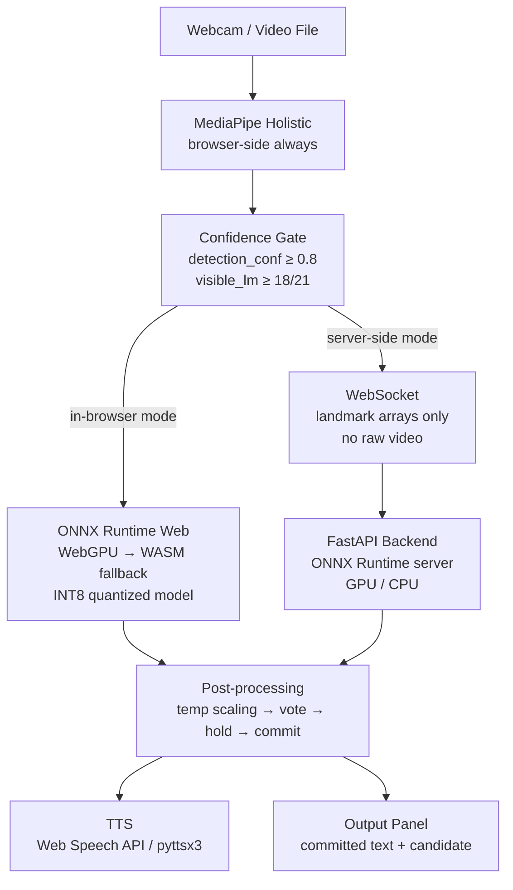

# Design Document: Real-Time Sign Language Interpreter

## Overview

This system is a real-time computer vision pipeline that translates ASL/BSL hand gestures from a live webcam or uploaded video into text and synthesized speech. It operates via a web interface with two deployment paths: server-side inference over WebSocket for high-accuracy word-level recognition, and in-browser inference using ONNX Runtime Web + WebGPU for privacy-first operation. The landmark-first architecture — extracting skeletal coordinates before classification — is the core design decision that makes real-time inference tractable across both paths.

The system is structured into four sequential stages:

```
Webcam (30fps · 720p)
    ↓
MediaPipe Holistic (landmarks: 21 hand × 2 + 33 pose + 468 face)
    ↓ confidence gate
Classification (lightweight MLP path OR 3D CNN + LSTM path)
    ↓
Post-processing (temporal gate → spell-check → gloss-to-English)
    ↓
Output (text panel + TTS)
```

---

## Architecture

### Dual Deployment Paths



### Component Boundaries

| Component | Location | Responsibility |
|-----------|----------|----------------|
| `MediaPipeExtractor` | Browser | Landmark extraction, confidence gate, normalization |
| `FingerspellMLP` (ONNX) | Browser or Server | Static pose → letter (A–Z), ≤20ms |
| `SignLSTM` (ONNX) | Server (primary) / Browser (quantized) | Sign sequence → gloss (WLASL-300), ≤80ms |
| `PredictionGate` | Browser + Server | Temperature scaling, majority vote, hold, cooldown |
| `OutputBuffer` | Browser | Committed text, candidate display, backspace |
| `GlossPostProcessor` | Browser (Transformers.js T5) | Gloss sequence → natural English |
| `FastAPI WS Server` | Server | WebSocket endpoints, ONNX Runtime sessions, validation |
| `InputQualityMonitor` | Browser | Luminance, FPS, hand-visibility status indicators |

---

## Components and Interfaces

### 1. MediaPipeExtractor

Runs MediaPipe Holistic in the browser. Never sends raw video to the server.

```python
class MediaPipeExtractor:
    def extract(frame) -> LandmarkResult | None
    # Returns None if confidence gate fails
    # LandmarkResult: { hand_lm, pose_lm, face_lm, handedness, detection_conf }

class LandmarkResult:
    hand_landmarks: np.ndarray   # (2, 21, 3) — right, left
    pose_landmarks: np.ndarray   # (33, 3)
    face_landmarks: np.ndarray   # (468, 3)
    handedness: list[str]        # ['Right', 'Left']
    detection_confidence: float
    visible_landmark_count: int
```

### 2. LandmarkNormalizer

Converts raw MediaPipe output to the feature vector the classifier expects.

```python
def normalize_landmarks(
    hand_lm: np.ndarray,   # (21, 3)
    mirror_left: bool,
) -> np.ndarray | None     # (63,) or None if degenerate

def build_two_hand_vector(
    right_lm: np.ndarray,  # (21, 3) or zeros
    left_lm: np.ndarray,   # (21, 3) or zeros
) -> np.ndarray            # (126,)

def add_velocity_features(
    sequence: np.ndarray,  # (T, 126)
) -> np.ndarray            # (T, 252)
```

### 3. FingerspellMLP

Static pose classifier. Input: `[batch, 63]`. Output: `[batch, 36]` logits.

Architecture: `Linear(63→256) → BN → ReLU → Dropout(0.3)` × 3 layers → `Linear(→36)`.

### 4. SignLSTM (3D CNN + LSTM)

Word-level classifier. Input: `[batch, 30, 252]`. Output: `[batch, 300]` logits.

```
Input [B, T=30, F=252]
    → Reshape each frame to [B, T, 1, 16, 16]  (zero-pad F to 256)
    → Conv3DBlock × 3  (channels: 1→32→64→128, temporal: 30→15)
    → Reshape to [B, 15, 128*H*W]
    → BiLSTM(hidden=256, layers=2, dropout=0.3)
    → TemporalAttention  (weighted sum over 15 timesteps)
    → LayerNorm → Dropout(0.4) → Linear(512→300)
```

### 5. PredictionGate

Three-layer filter applied after every inference call. Identical implementation in Python (server) and JavaScript (browser).

```
raw logit → temperature scaling (T=0.8) → softmax →
  layer 1: majority vote over last 7 frames →
  layer 2: hold queue — voted label must be stable for 12 frames →
  layer 3: cooldown — 20-frame gap between accepted predictions →
  accepted label OR None
```

### 6. FastAPI WebSocket Server

Two endpoints sharing a single ONNX Runtime session registry loaded at startup.

```
GET  /health       liveness probe
GET  /info         model metadata (vocab, seq_len, feature_dim)
WS   /ws/fingerspell   single-frame landmark → letter
WS   /ws/word          frame-buffer stream → gloss
```

Message protocol:

```json
// Client → Server (fingerspell)
{ "landmarks": [63 floats], "handedness": "Right" }

// Client → Server (word)
{ "landmarks": [126 floats], "frame_idx": 42 }
{ "type": "clear" }

// Server → Client
{
  "type": "fingerspell",
  "prediction": "H",
  "confidence": 0.94,
  "top5": [{"label": "H", "prob": 0.94}, ...],
  "accepted": true,
  "accepted_label": "H",
  "latency_ms": 3.2
}
```

### 7. GlossPostProcessor

Runs in-browser via Transformers.js (T5-small fine-tuned on ASLG-PC12, INT8 quantized, ~80 MB). Loaded as a background task after the ONNX classifier is ready.

```javascript
// Triggered when gloss buffer reaches ≥3 committed signs
async function glossToEnglish(glosses: string[]): Promise<string>

// Fingerspelling-specific: collapse repeated letters, detect word boundaries
function collapseAndSegment(
    letterStream: (string | null)[],
    pauseThreshold: number,   // frames of None = word boundary (default 8)
    minLetterHold: number,    // min frames to count a letter (default 4)
): string[]

// Edit-distance spell correction for A↔E, M↔N, S↔A confusions
function spellCheck(word: string, dictionary: Set<string>): string
```

### 8. InputQualityMonitor

Runs independently of the inference pipeline. Samples every 10 frames.

```javascript
interface QualityStatus {
    detectionConf: number;      // 0–1 from MediaPipe
    luminance: number;          // estimated lux-equivalent of hand region
    fps: number;                // delivered frame rate
    handsVisible: number;       // 0, 1, or 2
    status: 'good' | 'warn' | 'poor';
}
```

---

## Data Models

### LandmarkPayload (WebSocket wire format)

```typescript
interface FingerspellPayload {
    landmarks: number[];    // length 63, values in [-3.0, 3.0] after normalization
    handedness: 'Left' | 'Right';
}

interface WordPayload {
    landmarks: number[];    // length 126 (two-hand vector)
    frame_idx: number;      // monotonically increasing
}
```

### PredictionResult

```typescript
interface PredictionResult {
    type: 'fingerspell' | 'word';
    prediction: string;
    confidence: number;     // [0.0, 1.0]
    top5: Array<{ label: string; prob: number }>;
    accepted: boolean;
    accepted_label: string | null;
    latency_ms: number;
}
```

### OutputBuffer

```typescript
interface OutputBuffer {
    committed: string[];        // accepted words / letters
    candidate: string | null;   // in hold-window, not yet committed
    glossBuffer: string[];      // raw gloss stream for translation
}
```

### ModelCheckpoint (PyTorch .pt file)

```python
{
    "model_state": OrderedDict,
    "epoch": int,
    "val_acc": float,
    "label_to_idx": dict[str, int],
    "idx_to_label": dict[int, str],
    "hidden_dims": list[int],       # MLP only
    "seq_len": int,                 # SignLSTM only
    "feature_dim": int,             # SignLSTM only
    "use_velocity": bool,           # SignLSTM only
    "cnn_channels": list[int],      # SignLSTM only
    "lstm_hidden": int,             # SignLSTM only
}
```

### ONNX Sidecar (.labels.json)

```json
["A", "B", "C", ..., "Z", "0", ..., "9"]
```

---

## Correctness Properties

*A property is a characteristic or behavior that should hold true across all valid executions of a system — essentially, a formal statement about what the system should do. Properties serve as the bridge between human-readable specifications and machine-verifiable correctness guarantees.*

### Property 1: Confidence gate rejects low-quality frames

*For any* MediaPipe result where `detection_confidence < 0.8` OR `visible_landmarks < 18`, the confidence gate SHALL prevent classifier inference from running.
Conversely, *for any* result where both thresholds are met, the gate SHALL pass the landmark array to the classifier.

**Validates: Requirements 1.7**

---

### Property 2: Classifier confidence is always a valid probability

*For any* normalized landmark input to either the FingerspellMLP or the SignLSTM model, the returned confidence score SHALL be in the range [0.0, 1.0] inclusive.

**Validates: Requirements 2.2, 3.2**

---

### Property 3: PredictionGate commits exactly once per stable run

*For any* sequence of per-frame predictions fed into PredictionGate, if a single label occupies the majority of the vote window AND appears in every slot of the hold queue AND exceeds the confidence threshold AND the cooldown has expired, then the gate SHALL fire exactly once — emitting the label — and immediately enter cooldown, preventing a second emission from the same run.

**Validates: Requirements 2.4, 9.5, 9.6**

---

### Property 4: Word-level feature vector has correct shape

*For any* sequence of raw two-hand landmark arrays of length T (where T ≥ 1), the `add_velocity_features` function SHALL produce an array of shape `[T, 252]` — exactly double the input feature dimension of 126 — with the first 126 columns being the original positions and the last 126 being frame-over-frame deltas (zero-padded at t=0).

**Validates: Requirements 3.1**

---

### Property 5: Gloss-to-English returns non-empty string

*For any* non-empty sequence of valid ASL gloss tokens, the `GlossPostProcessor` SHALL return a non-empty string.

**Validates: Requirements 3.4, 5.9**

---

### Property 6: Landmark payload contains no raw image data

*For any* constructed WebSocket message (fingerspell or word), the serialized JSON payload SHALL contain only numeric arrays of expected length (63 or 126 floats) and SHALL NOT contain any array with length greater than 512 that could encode image pixel data.

**Validates: Requirements 3.5, 4.4**

---

### Property 7: Transcript append invariant

*For any* OutputBuffer state with N committed entries, performing one `accept(word)` operation SHALL result in exactly N+1 committed entries, with the new entry at position N equal to the accepted word.

**Validates: Requirements 5.3**

---

### Property 8: TTS text round-trip

*For any* string `s` (including Unicode, punctuation, and whitespace), serializing `s` to the TTS input format and deserializing it back SHALL produce a string equal to `s`.

**Validates: Requirements 5.5**

---

### Property 9: Fingerspelling collapse correctness

*For any* stream of per-frame letter predictions with runs of identical letters and gaps of `None` frames, the `collapseAndSegment` function SHALL:
- Collapse consecutive identical-letter runs of length ≥ `min_letter_hold` (4 frames) into exactly one letter
- Produce a word boundary whenever a run of `None` frames ≥ `pause_threshold` (8 frames) is observed

**Validates: Requirements 5.7**

---

### Property 10: Spell-check idempotence on dictionary words

*For any* word that is already present in the spell-check dictionary, calling `spellCheck(word, dictionary)` SHALL return the original word unchanged (`spellCheck(spellCheck(word)) == spellCheck(word)`).

**Validates: Requirements 5.8**

---

### Property 11: Backspace decrements committed length

*For any* OutputBuffer with N > 0 committed entries, calling `backspace()` SHALL result in exactly N−1 committed entries. Calling `backspace()` on an empty buffer SHALL leave the buffer unchanged (length remains 0).

**Validates: Requirements 5.10**

---

### Property 12: ONNX model serialization round-trip

*For any* valid landmark input `x`, loading a saved ONNX model file and running inference SHALL produce outputs identical (within floating-point epsilon of 1e-5) to the outputs produced by the original ONNX session before saving.

**Validates: Requirements 7.3**

---

### Property 13: INT8 quantization agreement with FP32

*For any* valid landmark input from the test distribution, the INT8-quantized ONNX model's top-1 predicted class SHALL agree with the FP32 model's top-1 predicted class at a rate ≥ 98% over a sample of ≥ 100 inputs.

**Validates: Requirements 7.2**

---

### Property 14: WebSocket payload validation rejects wrong-length arrays

*For any* landmark payload where `len(landmarks) != expected_dim` (63 for fingerspell, 126 for word), the server validation layer SHALL reject the payload and return a structured error response. *For any* payload where `len(landmarks) == expected_dim`, validation SHALL pass the array to the inference engine.

**Validates: Requirements 8.2**

---

### Property 15: WebSocket response contains all required fields

*For any* valid landmark input processed by the server, the JSON response SHALL contain all of: `type`, `prediction`, `confidence`, `top5`, `accepted`, `latency_ms`. No field SHALL be absent from any successful inference response.

**Validates: Requirements 8.3**

---

### Property 16: Landmark JSON serialization round-trip

*For any* landmark array with values in the expected normalized range, serializing the array to JSON and deserializing it SHALL preserve all values to within floating-point precision (absolute error ≤ 1e-6).

**Validates: Requirements 8.5**

---

### Property 17: ASL Citizen split signer integrity

*For any* sample in the ASL Citizen test split, the `signer_id` of that sample SHALL NOT appear in any sample in the training split. This invariant SHALL hold for the complete dataset as loaded by `SignSequenceDataset`.

**Validates: Requirements 10.3**

---

## Error Handling

| Error condition | Behavior |
|----------------|----------|
| No hand detected in frame | Skip classification, hold last valid prediction, show "No hand" status |
| Confidence gate rejects frame | Skip classification silently, no output change |
| MediaPipe loses tracking mid-sign | Clear frame buffer, reset prediction gate, wait for re-detection |
| WebSocket payload wrong length | Return JSON error `{"type": "error", "message": "..."}`, keep connection open |
| ONNX model file not found at startup | Log warning, mark endpoint as unavailable, return 503 on connect |
| In-browser WebGPU unavailable | Fall back to WASM backend automatically, log backend selection |
| T5 translation model fails to load | Disable translation UI, fall back to raw gloss display |
| WebSocket disconnect | Client reconnects with exponential backoff (500ms → 8s cap) |
| Backspace on empty buffer | No-op, buffer remains empty |
| Gloss-to-English produces empty string | Fall back to concatenated raw glosses |

---

## Testing Strategy

### Property-Based Testing Library

**Python backend**: [Hypothesis](https://hypothesis.readthedocs.io/) — the standard Python PBT library. Configure with `@settings(max_examples=100)` minimum per property.

**JavaScript frontend**: [fast-check](https://fast-check.io/) — the standard JS/TS PBT library. Configure with `{ numRuns: 100 }` minimum per property.

### Unit Tests

Unit tests cover specific examples, integration points, and error conditions that PBT generators cannot easily reach:

- MediaPipe result parsing with known-good fixture frames
- ONNX export produces a file with the correct input/output names and shapes
- WebSocket server starts and accepts a connection (integration smoke test)
- `collapseAndSegment` on a hand-crafted stream spelling "HELLO" (including the LL repeated letter)
- `spellCheck` corrects "NANE" → "NAME" and "HELO" → "HELLO"
- OutputBuffer `clear()` resets both `committed` and `glossBuffer`

### Property-Based Tests

Each correctness property (Properties 1–17) is implemented as a single PBT test. Tag format:

```
# Python: **Feature: sign-language-interpreter, Property {N}: {property_text}**
# JavaScript: /** Feature: sign-language-interpreter, Property {N}: {property_text} */
```

Generator guidance for each property:

- **Properties 1, 7, 14**: Generate random floats/integers for thresholds and array lengths
- **Property 2**: Generate random `Float32Array` inputs of length 63 or `[1, 30, 252]` tensors; verify output is scalar in [0.0, 1.0]
- **Property 3**: Generate random label sequences with controlled majority/minority ratios, random confidence values
- **Property 4**: Generate random arrays of shape `(T, 126)` for T in 1–60; verify output shape is `(T, 252)`
- **Property 5**: Generate random lists of uppercase ASCII words (1–10 tokens); verify output is non-empty string
- **Property 6**: Generate landmark arrays of length 63 and 126; verify no encoded field exceeds 512 elements
- **Properties 8, 16**: Generate arbitrary Unicode strings and float arrays; verify round-trip equality
- **Property 9**: Generate random letter streams with controlled run lengths and gap lengths
- **Properties 10, 11**: Generate random word strings and buffer states
- **Properties 12, 13**: Use a fixed set of ≥100 validation landmark samples; compare model outputs
- **Properties 15**: Generate random valid landmark arrays; verify all required fields present in response
- **Property 17**: Load dataset splits; verify signer_id disjointness between train and test sets

### Test File Organization

```
tests/
  unit/
    test_landmark_normalizer.py
    test_prediction_gate.py
    test_output_buffer.py
    test_payload_validation.py
    test_onnx_export.py
  property/
    test_prop_confidence_gate.py       # Property 1
    test_prop_classifier_confidence.py # Property 2
    test_prop_prediction_gate.py       # Property 3
    test_prop_feature_vector.py        # Property 4
    test_prop_gloss_translation.py     # Property 5
    test_prop_payload_schema.py        # Properties 6, 14, 15, 16
    test_prop_output_buffer.py         # Properties 7, 11
    test_prop_tts_roundtrip.py         # Property 8
    test_prop_fingerspell_collapse.py  # Property 9
    test_prop_spell_check.py           # Property 10
    test_prop_onnx_roundtrip.py        # Properties 12, 13
    test_prop_dataset_split.py         # Property 17
  js/
    gate.test.ts                       # Properties 2, 3 (fast-check)
    landmarks.test.ts                  # Properties 4, 9 (fast-check)
    output_buffer.test.ts              # Properties 7, 10, 11 (fast-check)
    ort_engine.test.ts                 # Properties 12, 13 (fast-check)
```
